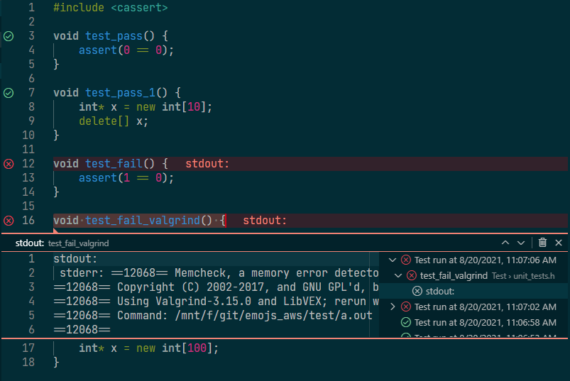

# vscode-cpp-unit-test
A simple and sweet VSCode extension to unit test C++ code.

## Setup
To use the extension, you'll need to:
1) Create a unit_tests.h file
2) Set up your Makefile
3) Start testing your code! 


### unit_tests.h

Create a file named ```unit_tests.h``` in the directory with your code. 

This file will hold test functions, each of which:

1) returns ```void```
2) takes no arguments

For instance, your ```unit_tests.h``` file might read:

```cpp
#include <cassert>
#include <iostream>

void test_pass() {
    assert(0 == 0);
}

void test_fail()) {
    assert(1 == 0);
}

void test_fail_valgrind() { //NOTE valgrind is broken on OSX and WSL
    int *x = new int[100];
}
```

```assert``` statements are encouraged!

Each test will effectively be run as its own 'main' by a driver that the extension creates for you.
However, you'll need to do a small bit of work to setup the Makefile.

## Makefile
Create a Makefile with a rule named ```unit-test``` which compiles your code with a file named ```unit-test-driver.cpp```. If you'd like to separate compilation and linking, that's fine, just
make sure you have a rule to build ```unit-test-driver.o``` from ```unit-test-driver.cpp``` (it has no dependencies except ```unit_tests.h```). For example:

```bash
GCC: clang++

unit-test: unit_tests.h unit-test-driver.cpp
    $(GCC) unit-test-driver.cpp
```

## Run Your Tests!
You'll see in your ```unit_tests.h``` file the buttons to run you tests. If you'd like to make groupings so they don't all run, include a comment of the form: 


Here is the output of running the tests!



You can run each test individually, or head to the 'test explorer panel, where there is a button to run all tests. 


Alternatively, you can create groups with a comment above the first test in a group as follows:

// TEST GROUP SOMENAME 

Note: this last part still needs some debugging. 

That's it! Happy testing :)

Matt