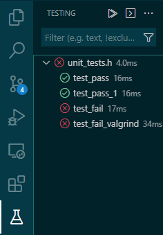

# vscode-cpp-unit-test
A simple and sweet VSCode extension to unit test C++ code.

## Setup
To use the extension, you'll need to:
1) Create a unit_tests.h file
2) Set up your Makefile
3) Start testing your code! 

###NOTE: We're still in alpha, so setup is a bit finicky. Please follow these instructions carefully!

### Getting started
If you haven't already, install the C++ Unit Testing Framework by AutumMoon from the VSCode Marketplace. 

Then, create and move into a new folder. 

```mkdir unittest_demo && cd unittest_demo```

Now, create a Makefile and unit_tests.h file:

```touch Makefile unit_tests.h```

Wonderful! Now, open this folder in a new workspace:

```code .```

If you see the testing panel open on the left-hand window, like in the image below then you're good to go! If not, just restart your VSCode instance, cd to the directory you just created, and again run ```code .```


### unit_tests.h

Now, we'll edit ```unit_tests.h```. This file will hold your test functions, each of which:

1) returns ```void```
2) takes no arguments

For instance, your ```unit_tests.h``` file might read:

```cpp
#include <cassert>
#include <iostream>

void test_pass() {
    assert(0 == 0);
}

void test_fail()) {
    assert(1 == 0);
}

void test_fail_valgrind() { //NOTE valgrind is broken on OSX and WSL
    int *x = new int[100];
}
```

```assert``` statements are encouraged!

Each test will effectively be run as its own 'main' by a driver that the extension creates for you. Valgrind will also be run on the test - it will fail if the main test fails or if valgrind fails (valgrind is run with --leak-check=full and --show-leak-kinds=all).

The last thing to do is to set up the Makefile.

## Makefile
Your ```Makefile``` will need a rule named ```unit-test``` which compiles your code with a file named ```unit-test-driver.cpp```. If you'd like to separate compilation and linking, that's fine, just make sure you have a rule to build ```unit-test-driver.o``` from ```unit-test-driver.cpp``` (it has no dependencies except ```unit_tests.h```). The below example will work fine for now.

```bash
CXX: clang++

unit-test: unit_tests.h unit-test-driver.cpp
    $(CXX) unit-test-driver.cpp
```
## Save!
Make sure you've saved both files.

## Run Your Tests!
Navigate back to ```unit_tests.h```. You should see 'play' buttons next to each test declaration. 


Press each one to play its test!


You can also head to the 'test explorer panel, where there is an overview of all tests, and a button to run all tests together. 



You can also create test groups with a comment above the first test in a group as follows:

```// TEST GROUP SOMENAME ```

The ```// TEST GROUP``` part of the string is necessary, but anything after that will work.


That's it! Happy testing :)

Matt
